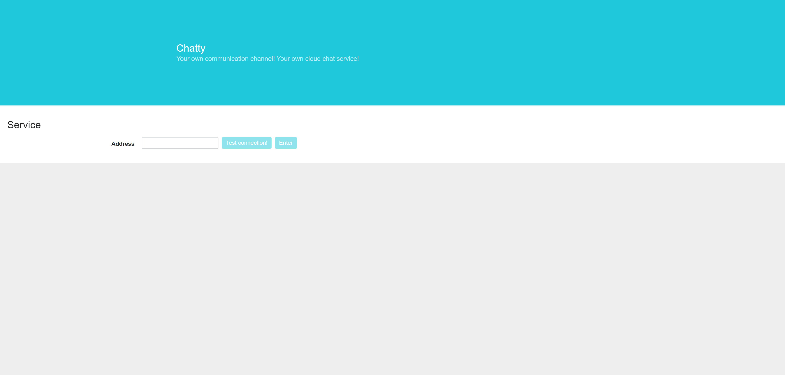
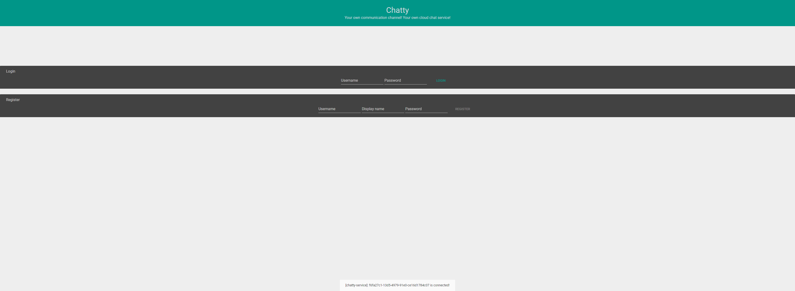

# Chatty 

### Intro

Chatty is a little project to create a self-hosting chat service.
The chat service is written in Kotlin with Ktor framework. It includes
an embedded web client. In the future there will be also an Android app.
The webclient is written in ReactJS and uses Material-ui to design the GUI.

### Current images (17.09.2017)
## Start site

## Authentication

## WIP Chat

